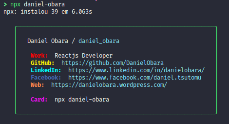

# Personal card in NPX - Daniel Obara :floppy_disk:

<h1 align="center">
  
</h1>
<h3 align="center">
  Meu cartão pessoal via npx daniel-obara
</h3>
<p align="center">
  <a>
    
  </a>
	<a href="https://www.linkedin.com/in/danielobara/">
    
  </a>
  <a href="https://github.com/danielobara/Meu-cartao-pessoalDanielObara/commits/master">
    
  </a>
   <a href="https://github.com/DanielObara/Meu-cartao-pessoalDanielObara/stargazers">
    
  </a>
</p>

This project was developed with the purpose to create a personal card in npm. 
Its just follow the @glaucia86 project and she based on Tierney Cyren repository.

To install my package use:

```
> npx daniel-obara

```

You can do yours in the footsteps of [Glaucia Lemos](https://github.com/glaucia86/glaucia86).


You can read more about me in the [LinkedIn](https://www.linkedin.com/in/danielobara)
or [My personal blog](https://www.danielobara.wordpress.com)
